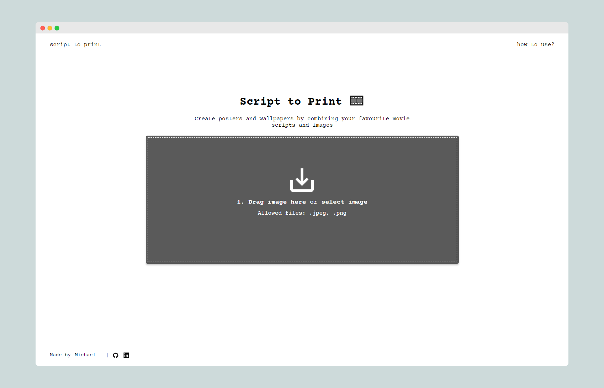

<!-- ABOUT THE PROJECT -->

# 🎞️ Script to Print

Create posters and wallpapers by combining your favourite movie scripts/books/lyrics and images. Script to Print utilises the HTML5 Canvas API to imprint and overlay images on text via pixel manipulation.

🔗 Link: [script-to-print.mttu.dev](https://script-to-print.mttu.dev/)\
🛠 Built with: `TypeScript, React, SASS`

<!-- FEATURES -->

## ✨ Features

- Simple and intuitive layout with drag and drop file upload and clear user instructions
- Responsive design that works with desktop and mobile
- Customisable settings to adjust text visuals
- Optimised pixel manipulation algorithm that minimises image generation time

<!-- ROADMAP -->

## 🚧 Roadmap

- [x] Update favicon with 🎞️ emoji
- [x] Finish "how to use?" modal
- [x] Fix 100vh for mobile devices

<!-- CONTACT -->

## 💬 Contact

Portfolio: [mttu.dev](https://mttu.dev)

Email: 2michael.tu@gmail.com

Project Link: [https://github.com/mtu2/script-to-print](https://github.com/mtu2/script-to-print)
